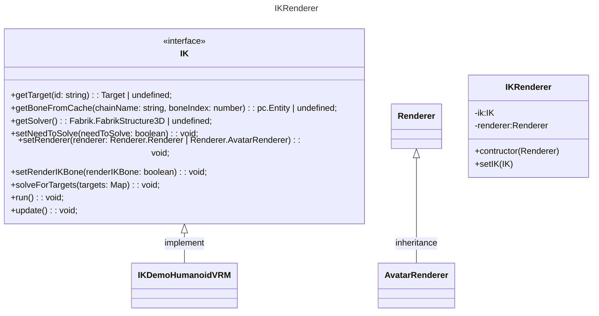

# FIK PlayCanvas

[Fabrik](http://www.andreasaristidou.com/FABRIK.html) algorithm rendered with [PlayCanvas](https://playcanvas.com/).

## Class Diagram

```mermaid
---
title: IKRenderer
---
classDiagram
    class IK {
      <<interface>>
      +getTarget(id: string): Target | undefined;
      +getBoneFromCache(chainName: string, boneIndex: number): pc.Entity | undefined;
      +getSolver(): Fabrik.FabrikStructure3D | undefined;
      +setNeedToSolve(needToSolve: boolean): void;
      +setRenderer(renderer: Renderer.Renderer | Renderer.AvatarRenderer): void;
      +setRenderIKBone(renderIKBone: boolean): void;
      +solveForTargets(targets: Map<string, Fabrik.Vec3>): void;
      +run(): void;
      +update(): void;
    }

    IK <|-- IKDemoHumanoidVRM: implement

    class Renderer {

    }

    Renderer <|-- AvatarRenderer: inheritance

    class IKRenderer {
      -ik:IK
      -renderer:Renderer
      +contructor(Renderer)
      +setIK(IK)
    }


```
