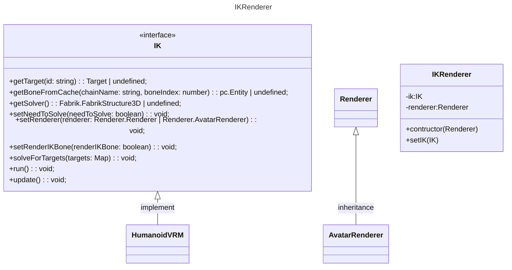

# FIK PlayCanvas

[Fabrik](http://www.andreasaristidou.com/FABRIK.html) algorithm rendered with [PlayCanvas](https://playcanvas.com/).

## Project layout

- `fabrik` - porting from [caliko](https://github.com/FedUni/caliko) to typescript

- `ik-renderer`

  - `ik` - implement Fabrik for humanoid

  - `renderer` - play canvas renderder

## Class Diagram



## How to use

```
  // get your VRM avatar
  const avatar = this.avatarRoot.findByName('VRM_AVATAR_RENDER');

  // init FIK.Renderer.AvatarRenderer with PlayCanvas application
  const renderer = new FIK.Renderer.AvatarRenderer(
    this.app,
    this.app.root,
    avatar,
    false
  );

  // init FIK.IKRenderer
  this.ikRenderer = new FIK.IKRenderer(renderer);

  // init IK implement
  const ik = new FIK.Implement.HumanoidVRM();

  // render IK bone for debug
  ik.setRenderIKBone(true);

  this.ikRenderer.setIK(ik);
  this.ikRenderer.run();
```

## Know issues

- In VR mode if MHD rotate-y 180 degrees, IK will fail.

## Todos

- `Fabrik` - local hinge with global axis constrained

- More IK algorithms (ideally, like [FinalIK](http://www.root-motion.com/finalikdox/html/index.html))
